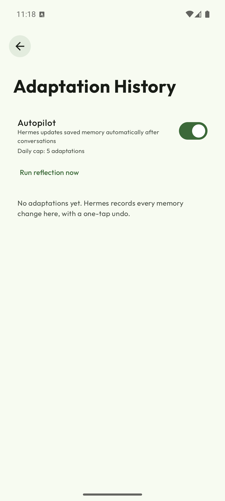
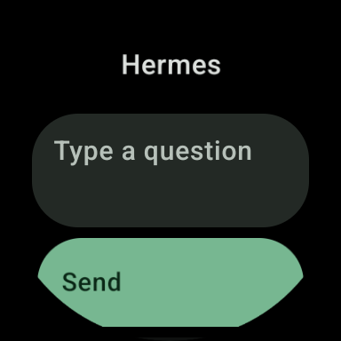

<div align="center">
  

  # Hermes X

  **An Android BYOK LLM client with agentic tools — and a Wear OS companion app.**

  A fork of [Agora](https://github.com/newo-ether/Agora) by the Agora authors (MIT).
  Maintained by **Michael** ([`michaelxdips`](https://github.com/michaelxdips)).
  Upstream attribution is unchanged — see [`NOTICE.md`](NOTICE.md).

  [](LICENSE)
  [](https://developer.android.com)
  [](https://kotlinlang.org/)
  [](https://github.com/michaelxdips/Agora/actions/workflows/build.yml)

  
</div>

> **Not published on any store.** Upstream Agora ships on F-Droid and Google Play; this fork ships
> only through [its own GitHub Releases](https://github.com/michaelxdips/Agora/releases/latest).
> It installs side by side with upstream Agora (`com.hermes.app` vs `com.newoether.agora`), and the
> upstream user manual still applies to the shared product.

---

## At a glance

| | Hermes X (this fork) | Upstream Agora |
|---|---|---|
| `applicationId` | `com.hermes.app` | `com.newoether.agora` |
| `versionName` | `3.0.3-hermesx` (`versionCode` 34) | `2.1.0` (`versionCode` 31) |
| Release signing identity | `[certificate DN omitted]` | `CN=Newo Ether` |
| Release certificate SHA-256 | `7188ce70…aa56d7` | `5de26f26…be1aa29` |
| Distribution | [GitHub Releases](https://github.com/michaelxdips/Agora/releases/latest) — phone + watch APK | F-Droid, Google Play, GitHub Releases |
| Update channel | **this fork's own GitHub Releases** | upstream's releases |
| Wear OS app | `wear/` — same `applicationId`, same key (Data Layer requirement) | none |

Because the package name, the signing key and the release channel all differ, the two apps coexist on
one device and neither can silently replace the other. That is also why the in-app update check must
never point at upstream — see [Update channel](#update-channel).

## What this fork adds

| Addition | Where | Notes |
|---|---|---|
| **Autopilot memory** | `app/src/main/java/com/newoether/agora/autopilot/` | After a conversation goes idle, a reflection pass proposes memory facts and writes them with a before/after snapshot in its own Room DB (`hermes_autopilot.db`). Never extends upstream's DB. |
| **Adaptation History + undo** | Settings → Memory & Data → *Adaptation History* | Every change is listed with a diff and a one-tap undo; a correction heuristic rolls back a bad adaptation automatically. Daily cap of 5. |
| **Persona system** | `personas/`, `app/src/main/assets/personas/` | Vendored Caveman (`v2.6.0`) and Ponytail (`v4.10.0`) rule texts (MIT, pinned refs + SHA-256 in `personas/upstream.lock`) injected as delimited blocks into the active-memory file, removed without trace when switched off. |
| **Wear OS module** | `wear/` | Standalone watch app: BYOK on the watch itself, or pairing with the phone app over the Data Layer. Typing, voice input, an offline queue with exactly-once delivery, and held-question cards. |
| **Update checker** | `app/src/main/java/com/newoether/agora/util/UpdateChecker.kt` | Points at *this* fork's releases; daily check on launch, plus a manual check in Settings → About. |
| **Upstream sync automation** | `scripts/upstream_sync.sh`, `.github/workflows/upstream-sync.yml` | Dry-run by default; the merge is scripted and the CI job runs it on a schedule. |
| **Touchpoint guard** | `scripts/touchpoint_guard.sh`, `UPSTREAM_TOUCHPOINTS.md` | Upstream files are read-mostly. Every deliberate edit to one is registered with a line budget, and the guard fails the build when an unregistered edit or a blown budget appears. |

Rebranding is confined to `applicationId` (`com.hermes.app`), the display name, and resource
overlays — no upstream behaviour is rewritten. The full list of edited upstream files, with reasons
and budgets, is in [`UPSTREAM_TOUCHPOINTS.md`](UPSTREAM_TOUCHPOINTS.md).

## Update channel

The About screen checks GitHub for a newer release of **this fork** and offers a link to the release
page. Three things make that non-trivial in a fork, and all three are settled in code:

| Property | Value | Why it matters |
|---|---|---|
| Repository queried | `michaelxdips/Agora` (via `HermesBuildInfo.FORK_REPO`) | Querying upstream's releases would offer an APK with a different package name and a different signing key. Installing it over Hermes X fails with `INSTALL_FAILED_UPDATE_INCOMPATIBLE`, so it is a *wrong* offer, not a missed one. |
| Version comparison | segment-wise; numeric outranks non-numeric | `3.0.1` beats `3.0.0-hermesx`; a plain release beats the same number with a fork suffix; `v1.2.3-rc1` is ordered instead of collapsing to `0`. |
| Failure mode | always `null` | Offline, rate-limited or "no releases yet" all mean *no update*, never a fabricated one. A `CancellationException` is rethrown rather than swallowed. |

The live release is checked in both directions by
`app/src/test/.../autopilot/ReleaseVersionOrderingTest.kt`: `v3.0.3` **is** offered to a
`3.0.2-hermesx` install and **is not** offered to a `3.0.3-hermesx` one — the second direction is the
defect that shipped with `v3.0.1` (a device on a release was offered that same release on every
launch).

**Current state: releases are live** — [`v3.0.3`](https://github.com/michaelxdips/Agora/releases/tag/v3.0.3)
is the current one, and `v3.0.1` is marked *pre-release* because it shipped a debug-signed phone APK
and the update-check defect described below. Every APK on `v3.0.3` carries `versionName 3.0.3-hermesx`.

**A defect the first release exposed, and the fix:** the fork's own version string carries a suffix
(`3.0.2-hermesx`) while a GitHub tag does not (`v3.0.2`). Segment-wise a numeric segment outranks a
non-numeric one, so `compare(tag, installed) > 0` was **true for the version already installed** — a
device on `3.0.1-hermesx` was offered `v3.0.1` on every launch. `UpdateChecker.isNewer` now compares
base versions (suffix dropped) and treats a suffix-only difference as not-an-update; the regression is
pinned by `app/src/test/.../autopilot/ReleaseVersionOrderingTest.kt`, which failed
(`expected:<0> but was:<1>`) before the fix.

Tagging rule: use a version above `3.0.0-hermesx` (e.g. `v3.0.2`). The fork also carries upstream's
older tags (`v2.1.0`, `v2.0.0`, …) from the fork point; a release built from one of those is
correctly *not* offered as an update.

## Downloads

Every release carries **both** APKs, built from the same commit, signed with the **same
certificate** — the Wear OS Data Layer refuses to pair a phone and a watch whose package name *or*
signing certificate differ, so mixing APKs from two different releases breaks pairing.

| App | File | Size (bytes) | SHA-256 |
|---|---|---|---|
| Phone (Android 8+, `minSdk` 26) | [`app-fdroid-release.apk`](https://github.com/michaelxdips/Agora/releases/latest/download/app-fdroid-release.apk) | 49,616,015 | `32de63ec9673989869df44fb20aa96f97f4d78fec3b1319a5ce06faa35c4c7fd` |
| Watch (Wear OS 3+, `minSdk` 30) | [`wear-release.apk`](https://github.com/michaelxdips/Agora/releases/latest/download/wear-release.apk) | 2,763,831 | `ae5cfbc298dc69322cab3d3c88708ca4ece47df450a02087008b4cfaceff2fa5` |

`SHA256SUMS` ships in the same release for `sha256sum -c`. Verify the signing identity before
installing:

```bash
sha256sum -c SHA256SUMS
apksigner verify --print-certs app-fdroid-release.apk
# [certificate DN omitted]
# SHA-256 7188ce700b7407485e4a588cc1ef779fba4bd47c635338b05f61d5fc90aa56d7
```

Both APKs in `v3.0.3` carry that certificate. It is a **self-signed** release key (the same one the
project's own `local.properties` points at), not a store key; the value of checking it is that it
must match on both APKs, because that is the condition the Data Layer enforces.

The phone APK is the F-Droid flavor built by CI, so it includes the PRoot runtime
(`libproot_exec.so`, `libproot_loader.so`, `libtalloc.so`) that a local build on a machine without
the NDK toolchain cannot produce. CI signs it with the release key from the repository's
`KEYSTORE_BASE64` / `KEYSTORE_PASSWORD` / `KEY_ALIAS` / `KEY_PASSWORD` secrets; without those secrets
the workflow falls back to the debug key and the phone APK would no longer pair with the watch APK.

## Wear OS companion

The watch app is standalone (no phone required) and pairs with the phone app when one is present.
Both APKs share `com.hermes.app` **and the same signing key** — the Data Layer refuses to pair
otherwise.

| Data Layer path | Direction | Type | Purpose |
|---|---|---|---|
| `/hermes/pair` | watch → phone | Message | Pairing request (protocol version + product name) |
| `/hermes/pair/ack` | phone → watch | Message | Result of the request, rendered as text on the watch |
| `/hermes/config` | phone → watch | DataItem | Base URL, API key, model; deleted from the store once consumed |
| `/hermes/memory` | phone → watch | DataItem | Memory snapshot for the watch's core context |

The watch looks for the `hermes_phone` capability (`CapabilityClient.FILTER_REACHABLE`), declared
statically in `app/src/{fdroid,play}/res/values/wear.xml`. If no reachable node advertises it, the
watch says so explicitly — `No phone app found. Install it and open it once, or use a key on the
watch.` — and BYOK on the watch keeps working.

Phone side: `autopilot/wearsync/` (`PairingListenerService`, `WatchSync`, `SettingsWatchSetupPage`).
Watch side: `wear/` (`WearPairing`, `WearListeners`, `WearOfflineQueue`, `WearQueueDrainer`).

### What the watch shows, and why it can

A watch screen is a bad place for markup. `WearChatClient.parseContent` used to return the provider's
`content` verbatim, so a model answering `**Jawaban:** 14` or `$\frac{1}{2}$` put those characters in
front of the user on a display that has no Markdown renderer and no math font.
`WearAnswerText.render` is now the single decision point — pure Kotlin, no new dependency, so the
watch module stays small:

| Input | On the watch |
|---|---|
| `**bold**`, `_x_`, `~~strike~~`, `` `code` `` | `bold`, `x`, `strike`, `code` |
| `# Heading`, `- item`, `> quote` | `Heading`, `• item`, `quote` |
| `\| a \| b \|` table rows | `a  b` |
| `[text](url)` | `text` |
| ` ``` ` fences | dropped, the code inside is kept |
| `\frac{1}{2}` | `1/2` · `\frac{x+1}{2}` → `(x+1)/2` |
| `x^{2}`, `H_{2}O` | `x²`, `H₂O` |
| `\sum_{i=1}^{n}`, `\int`, `\sqrt{9}` | `∑ᵢ₌₁ⁿ`, `∫`, `√9` |
| `\times \le \ge \ne \pm \infty \pi \Delta \theta \mu` | `× ≤ ≥ ≠ ± ∞ π Δ θ µ` |
| `⁲⁳₏₝₞₟ ⏻⏼` | readable fallbacks — **no font on this image has them** |

"Has a glyph" is measured, not assumed: the five fonts on the Wear OS image were pulled off the device
and their cmaps read (`DroidSans` 2,797 · `DroidSansMono` 873 · `NotoSansSymbols` 4,616 + 124 ·
`NotoColorEmoji` 1,449 → union **8,755 codepoints**). `NotoSansMath-Regular.ttf` is **not on the
image**. `WearFontCoverage.kt` is generated from those cmaps and `WearAnswerTextCoverageTest` fails if
the renderer ever emits a character outside them — it caught `U+2072` passing straight through.

Layout was measured on five screen profiles with real `wm size` / `wm density` overrides; every row was
re-measured with a freshness check (a dump can return the *previous* profile's layout before the new
configuration is laid out, which produced a wrong number twice before the check existed):

| Profile | Screen | Text column | % of width |
|---|---|---|---|
| small round (the AVD) | 384 px @320 = 192.0 dp | 264 px = 132.0 dp | 68.8 % |
| large round | 454 px @320 = 227.0 dp | 326 px = 163.0 dp | 71.8 % |
| **Xiaomi Watch 2** | 466 px @326 = **228.7 dp** | **338 px = 165.9 dp** | **72.5 %** |
| 480 round | 480 px @360 = 213.3 dp | 336 px = 149.3 dp | 70.0 % |
| rectangular | 400 px @320 = 200.0 dp | 276 px = 138.0 dp | 69.0 % |

The answer card measures the same width as the composer at every profile (both are
`fillMaxWidth().padding(horizontal = 8.dp)`), which is the cross-check that the numbers describe the
element they claim to.

No element is cut off or outside the round mask at the Xiaomi Watch 2 geometry. Touch targets were
measured on the clickable node with a freshness gate: `Send`, `Change key` and `Debug` clear 48 dp
everywhere (50.0–52.0 dp). The one real shortfall is the composer field at 466×466 — 165.9×47.6 dp,
**0.39 dp** under the 48 dp target — which is the framework's own field height inside the Wear `Card`,
not a value this layout sets. Rows that appear shorter in a dump are `ScalingLazyColumn` items clipped
by the viewport edge, not small controls; the full table, including that distinction, is in
[`STATUS.md`](STATUS.md). Two defects were found by running it rather than reading it: **every
answer crashed the app** (`verticalScroll` inside a `ScalingLazyColumn` item is an
`IllegalStateException` — the user-visible symptom was that the answer never appeared), and the voice
fallback was collected but rendered nowhere. Both are fixed; see
[`evidence/wear-render-2026-09-16.md`](evidence/wear-render-2026-09-16.md) for the raw output.

Known limit: the phone → watch **push** half has never been exercised end to end on this machine.
Both emulators have `Accounts: 0` (`adb shell dumpsys account`), and the Data Layer requires both
devices to be signed in to the same Google account, so `CapabilityClient.FILTER_REACHABLE` returns
no node and the watch honestly reports `No phone app found…`. The signing half *is* verified: both
APKs on `v3.0.3` carry the same certificate, which is the other condition the Data Layer enforces.
Recorded as HS4 in [`STATUS.md`](STATUS.md) rather than claimed as working.

## Screenshots

Captured on the `hermes_x86_64` emulator and the `hermes_wear5` AVD during phase verification —
test-build screenshots, not marketing shots.

<table>
<tr>
<td width="50%"></td>
<td width="50%"></td>
</tr>
<tr>
<td><b>Phone —</b> Adaptation History: the autopilot toggle, the daily cap, and the undo list.</td>
<td><b>Watch —</b> the chat screen: composer, voice, and the held-question queue.</td>
</tr>
</table>

More evidence lives in [`evidence/`](evidence/) (27 tracked files: screenshots, session logs and the
probe scripts that produced them) and is indexed in [`STATUS.md`](STATUS.md).

## Inherited from upstream

Everything below is Agora's, unchanged, and is documented in full in the
[upstream user manual](https://newo-ether.github.io/Agora/) and [`ARCHITECTURE.md`](ARCHITECTURE.md):

- **Nine built-in provider types:** OpenAI, Anthropic, Google Gemini, DeepSeek, Qwen/DashScope, OpenRouter, Groq, Ollama, and Local llama.cpp; custom endpoints support OpenAI-compatible, Google, or Anthropic protocols.
- **Tree-structured conversations:** edit or regenerate earlier messages without discarding alternative branches.
- **Token-budget context:** 4K–1M estimated-token budgets and non-destructive Compact capsules that retain a verbatim recent suffix.
- **Agentic tools:** web search, memory, past-conversation RAG, image generation, MCP servers, Tasks/Loops, remote shell/files, durable Conch jobs, and an F-Droid Alpine sandbox.
- **Local intelligence:** GGUF chat models and local embeddings through llama.cpp.
- **Portable data:** versioned `.agora` ZIP archives, ChatGPT/Claude imports, and scheduled backups.
- **Customizable UI:** Material 3 themes, fonts, haptics, thinking/tool presentation, and 12 explicit interface languages plus system default.

## Build from source

| Requirement | Version used here |
|---|---|
| JDK | 21 (Temurin 21.0.12.1+1) |
| Android SDK | `compileSdk 36`, `targetSdk 36`, `build-tools 36.0.0`, `ndk 28.2.13676358`, `cmake 3.22.1` |
| Gradle | wrapper 9.5.1 |
| `minSdk` | 26 (phone) · 30 (watch) |
| Submodules | `thirdparty/llama.cpp`, `thirdparty/proot`, `thirdparty/talloc` |

```bash
git clone --recurse-submodules https://github.com/michaelxdips/Agora.git
cd Agora

export JAVA_HOME=<path-to-jdk-21>
export ANDROID_HOME=<path-to-android-sdk>
export ANDROID_SDK_ROOT="$ANDROID_HOME"   # the emulator refuses to start without it

./gradlew assembleFdroidDebug           # or assemblePlayDebug
./gradlew assembleFdroidRelease         # needs a keystore, see below
./gradlew :wear:assembleDebug           # watch APK
./gradlew :app:testFdroidDebugUnitTest  # JVM unit tests
./gradlew :wear:testDebugUnitTest
./gradlew verifyKotlinFileSize          # source-size policy
bash scripts/touchpoint_guard.sh        # upstream-edit guard
SYNC_DRY_RUN=1 bash scripts/upstream_sync.sh
```

Release builds sign through `local.properties` (`storeFile`, `storePassword`, `keyAlias`,
`keyPassword`). That file and any `*.jks` are excluded via `.git/info/exclude` and are never
committed — a fresh clone builds debug only until you supply your own key.

The F-Droid flavor needs `./build-proot.sh` to have run before packaging (the CI workflow does this
for you). The `play` flavor does not.

Install over an existing build of the *same* signing identity, or uninstall first:

```bash
adb uninstall com.hermes.app     # debug and release are signed differently here
adb install app/build/outputs/apk/fdroid/debug/app-fdroid-debug.apk
```

### Measured build outputs

| Artifact | Size (bytes) |
|---|---|
| `app/build/outputs/apk/fdroid/debug/app-fdroid-debug.apk` | 65,313,396 |
| `app/build/outputs/apk/fdroid/release/app-fdroid-release.apk` (local build, **no PRoot runtime**) | 49,499,989 |
| `app/build/outputs/apk/fdroid/release/app-fdroid-release.apk` (CI build, published as `v3.0.2`) | 49,616,015 |
| `wear/build/outputs/apk/release/wear-release.apk` (published as `v3.0.2`) | 2,768,539 |

The two phone numbers differ by 16,026 bytes, and that difference *is* the PRoot runtime: a local
`assembleFdroidRelease` cannot run `build-proot.sh` (it needs the NDK toolchain and `make`, neither of
which exists on this machine or in its WSL image), so only the CI artifact is a complete F-Droid build.

## Verification

The fork's rule is that no status is claimed without a command behind it. Current numbers, all
reproducible on a clean checkout:

| Gate | Result |
|---|---|
| `:app:testFdroidDebugUnitTest` | **2,562 tests, 0 failures, 0 errors** (394 XML reports) |
| `:wear:testDebugUnitTest` | **82 tests, 0 failures, 0 errors** (9 XML reports) |
| `verifyKotlinFileSize` | pass |
| `scripts/touchpoint_guard.sh` | **PASS** — 14 registered upstream touchpoints, 13 currently carrying a diff |
| `SYNC_DRY_RUN=1 scripts/upstream_sync.sh` | exit 0 |
| CI (`.github/workflows/build.yml`) | green on `main` — unit tests + release-signed F-Droid build |
| Both release APKs | `apksigner verify --print-certs` → `7188ce70…aa56d7` on **both** (the Data Layer pairing condition) |
| Published assets | re-downloaded from `releases/latest/download` → HTTP 200, `sha256sum -c SHA256SUMS` **OK** for both |

The wear count rose from 61 to 82 with the render work: `WearAnswerTextTest` (the mapping),
`WearAnswerTextCoverageTest` (every emitted character against the device's real font cmaps), and
`WearAnswerLeakTest` (the regression that was red before the fix).

`git status --porcelain` is clean, and no build artifact, keystore or `local.properties` is tracked.

## Staying in sync with upstream

This fork tracks `newo-ether/Agora` (`master`). `main` is currently **83 commits ahead of the fork
point** (`914e7c8d`), and upstream is **5 commits ahead** of that same point — those five are not in
`main` yet. Upstream keeps moving, and the sync protocol is built so that a merge is a *reviewed*
event, not a silent one:

```bash
git fetch upstream
SYNC_DRY_RUN=1 bash scripts/upstream_sync.sh   # resolve in a throwaway worktree, report only
bash scripts/upstream_sync.sh                  # real merge on main
bash scripts/touchpoint_guard.sh               # must pass after the merge
```

Conflict policy ([`UPSTREAM_SYNC.md`](UPSTREAM_SYNC.md)):

1. Conflict in a **registered touchpoint** → keep ours, then re-apply the Hermes edit.
2. Conflict in a **Hermes-only** path → keep ours (upstream cannot legitimately touch it).
3. Conflict **anywhere else** → abort, leave `main` untouched, fail the job. Upstream moved a
   contract we depend on.

The script then runs the unit tests and the F-Droid debug build *in the merged tree*, so the result
is evidence about what is being promoted rather than about the branch that existed before the merge.
An upstream change to `development/*.md` or `ARCHITECTURE.md` is reported as a contract change
(N10) and must be re-read before further feature work.

## Documentation

| Document | What it is |
|---|---|
| [`AGENTS.md`](AGENTS.md) | The fork's ground rules. Read this before touching anything. |
| [`ROADMAP.md`](ROADMAP.md) | Phases delivered, with the evidence table for each. |
| [`STATUS.md`](STATUS.md) | The evidence log: command output, test counts, APK hashes, and the audit findings that were not fixed. |
| [`CODE_MAP.md`](CODE_MAP.md) | One row per file this fork owns, with a "worth a close read?" column. |
| [`UPSTREAM_TOUCHPOINTS.md`](UPSTREAM_TOUCHPOINTS.md) | Every edited upstream file and its line budget. |
| [`UPSTREAM_SYNC.md`](UPSTREAM_SYNC.md) | How an upstream merge is performed here. |
| [`ARCHITECTURE.md`](ARCHITECTURE.md) | Upstream's runtime, persistence, providers, tools, and data flows. |
| [`V2_BACKLOG.md`](V2_BACKLOG.md) | Candidate work with a cost/benefit table, including the "never" column. |
| [`PRIVACY.md`](PRIVACY.md) · [`NOTICE.md`](NOTICE.md) | Privacy policy and attribution. |
| [User manual](https://newo-ether.github.io/Agora/) | Upstream's docs site — applies to the shared product. |

The audit and mandate documents this fork accumulated while it was being built (`GAP_ANALYSIS.md`,
`AUDIT_PLAN.md`, `AUDIT_REPORT.md`, `CLEANUP_SCAN.md`, `CLEANUP_REPORT.md`, `HANDOVER.md`,
`MEGA_PROMPT_*.md`) are deliberately **not** in the repository. Where one of them is cited as the
source of a recorded result, `STATUS.md` says so.

## Known limitations

Stated plainly, because a fork that hides its gaps cannot be trusted with the parts that work:

- **Releases are source-signed, not store-signed.** `v3.0.3` exists and both APKs carry the same
  release certificate, so the update check is live; but the key is self-signed and the F-Droid flavor
  is only built by CI (a local `assembleFdroidRelease` on a machine without the NDK toolchain and
  `make` produces an APK **without** the PRoot runtime).
- **Phone → watch push is unproven** (HS4): needs two Data-Layer-paired devices with the same Google
  account. Both emulators here report `Accounts: 0`, so the watch reports `No phone app found…` by
  design. The watch's own paths (BYOK, offline queue, core context) are verified on the API 34 wear
  image, the pairing *decision logic* is covered by 8 unit tests, and the signing condition the Data
  Layer enforces is verified on both release APKs.
- **Answer quality with the memory core context is unmeasured** (HS2): a local mock has no knowledge,
  so "does 500 tokens of memory make the watch's answers better?" cannot be answered here. Its *cost*
  is measured — a 1,625-byte snapshot becomes a 1,624-char / 406 estimated-token `system` message —
  and the feature is kept because it is the only thing that makes an answer about *this* user.
- **No automated device test in CI.** Instrumented tests run locally against an emulator; CI covers
  JVM unit tests and the release build.
- **`main` is the only long-lived branch.** Feature work happens on branches; `main` must always
  build.

## Contributing

Issues and pull requests are welcome. Three rules matter more than the rest:

1. **`main` must always build.** Work on a branch and merge only after verification.
2. **Never disable a test or a guard to make a gate pass.**
3. **Never force-push.**

## License

MIT, unchanged from upstream — see [`LICENSE`](LICENSE). The fork does not relicense any upstream
file. The bundled persona rule texts are third-party MIT works, credited in [`NOTICE.md`](NOTICE.md).
